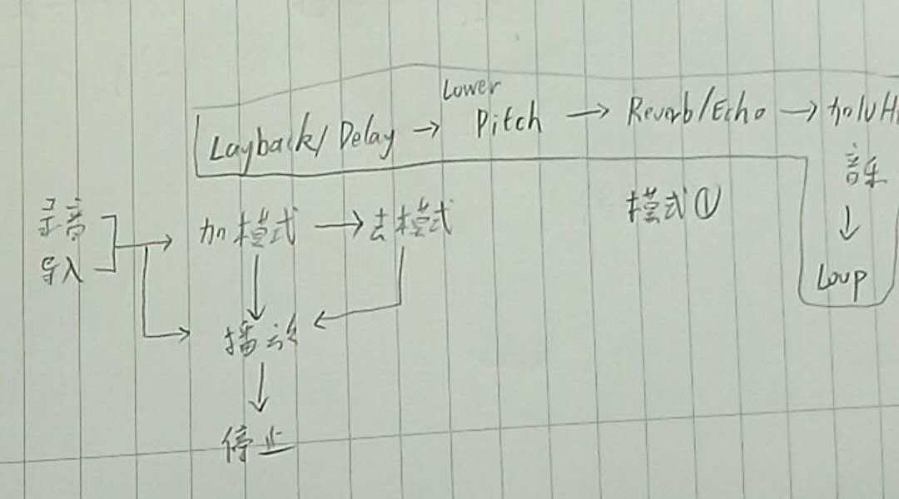

# Sound processing

### Reference
* https://www.transparentcorp.com/products/np/tutorials/WorkingWithRecordings/index.html
* https://www.youtube.com/watch?v=zrR3reCq564

### Useful data
* [音高频率表](https://zh.wikipedia.org/wiki/%E9%9F%B3%E9%AB%98#.E9.9F.B3.E9.AB.98.E9.A0.BB.E7.8E.87.E8.A1.A8)

### tutorial
* https://css-tricks.com/introduction-web-audio-api/
* https://benzleung.github.io/2017/03/15/Web-Audio-API-Guide-Advanced-User/
